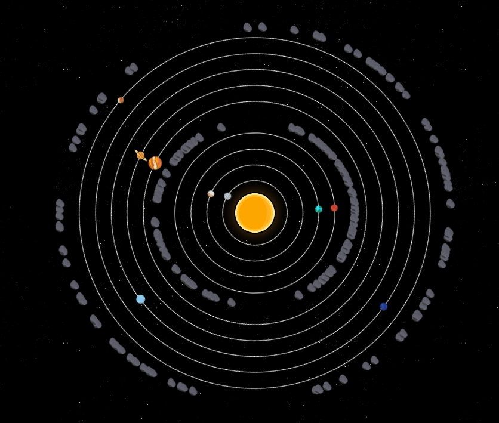

# Solar system

Вы также можете прочитать этот README на [английском](https://github.com/klekwedge/solar-system/blob/main/README.md)

## Оглавление

- [Инструкции по развертыванию](#инструкции-по-развертыванию)
- [Обзор](#обзор)
  - [Скриншот](#скриншот)
  - [Ссылки](#ссылки)
- [Мой процесс](#мой-процесс)
  - [Стек](#стек)
  - [Что я узнал](#что-я-узнал)
- [Автор](#автор)

## Инструкции по развертыванию

**Для запуска проекта на вашем компьютере должны быть установлены [npm](https://nodejs.org/en/) и [git](https://git-scm.com/downloads)**

1. Сделайте клон этого репозитория ```git clone https://github.com/klekwedge/solar-system.git```
2. Установите все необходимые пакеты npm с помощью ```npm i```
3. Запустите проект командой ```npm run dev```

## Обзор

### Скриншот



### Ссылки

- [Ссылка на проект](https://github.com/klekwedge/solar-system)
- [Деплой](https://klekwedge-solar-system.vercel.app/)

## Мой процесс

### Стек

- React
- TypeScript
- Chakra UI
- SCSS
- Vite

### Что я узнал

Я научился случайным образом генерировать астероиды, появляющиеся по кругу орбиты, понял, как работают анимация вращения планеты вокруг своей оси и анимация вращения вокруг солнца. Генерируйте псевдослучайные планеты на орбите. Я понял, как псевдо случайно сгенерировать планеты на орбите.

## Автор

- [Вебсайт](https://klekwedge-cv.vercel.app/)
- [Linkedin](https://www.linkedin.com/in/klekwedge/)
- [Facebook](https://www.facebook.com/klekwedge)
